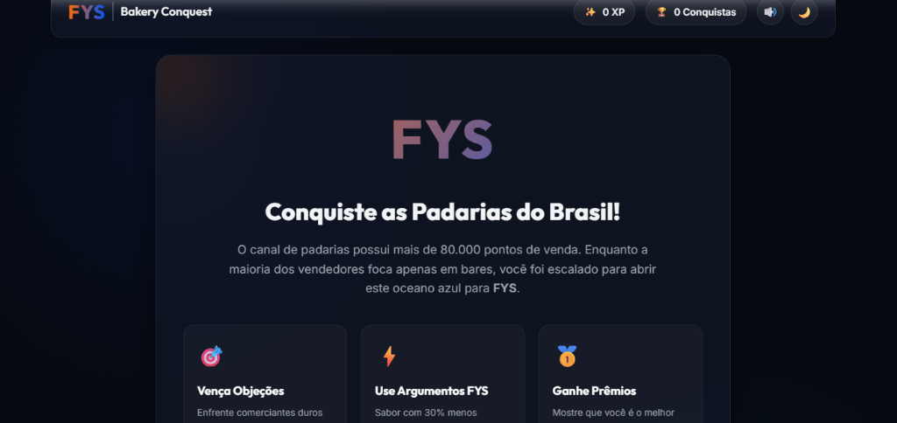
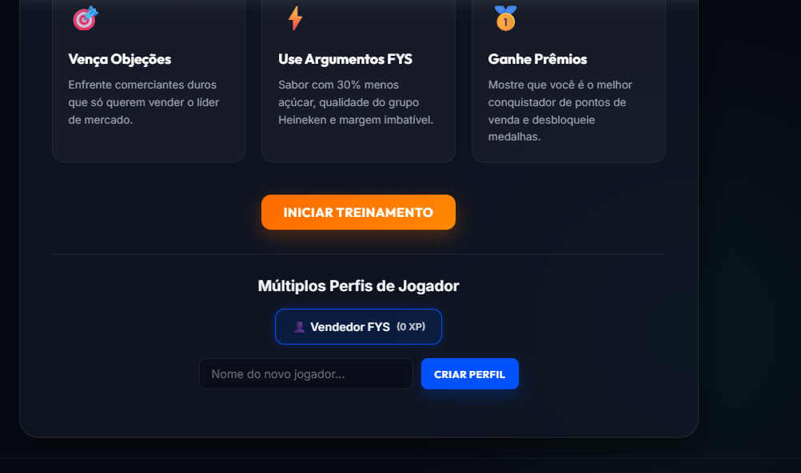
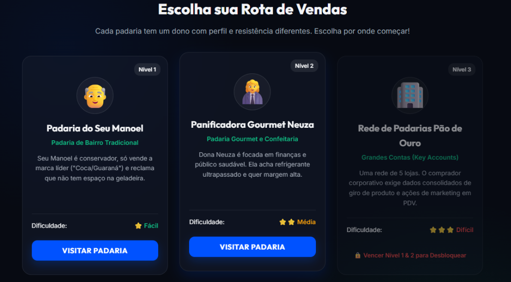
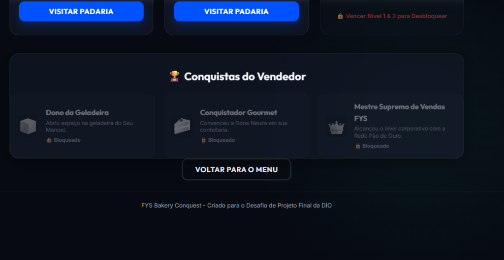
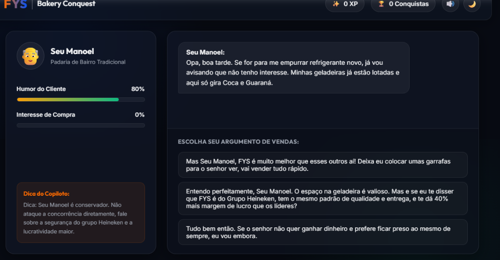
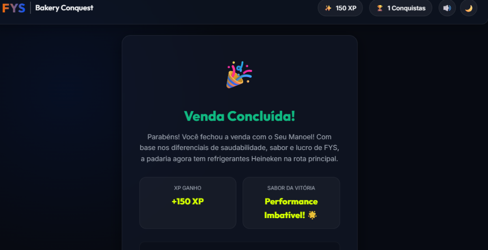
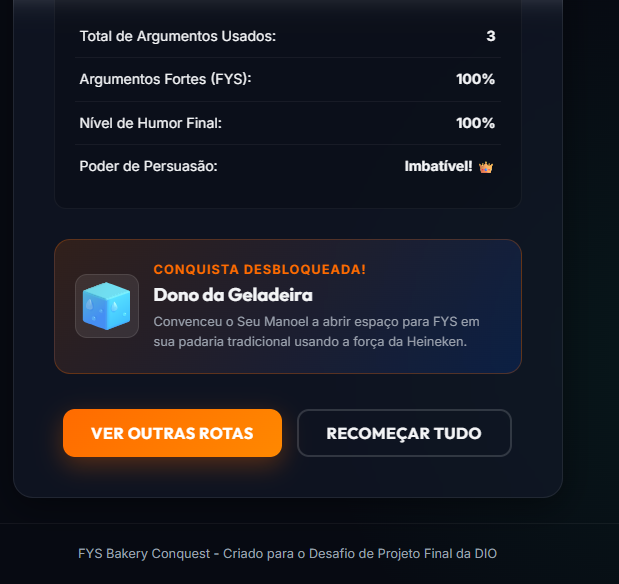
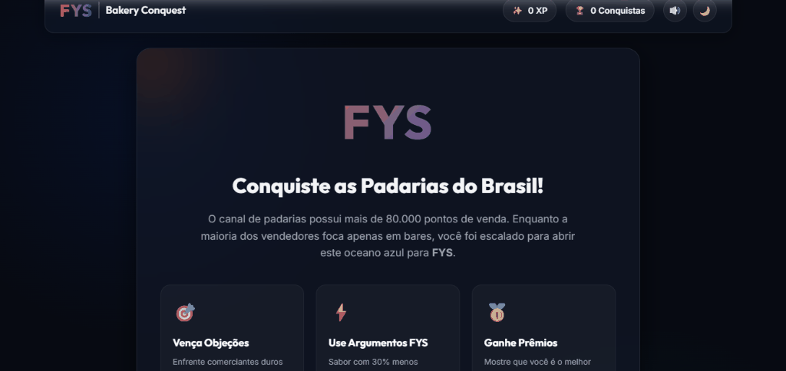

# 🥐 FYS Bakery Conquest

Uma aplicação web interativa e gamificada projetada para treinar vendedores e promotores do grupo Heineken a contornar objeções e ativar a marca de refrigerantes **FYS** no canal de padarias do Brasil.

---

## 🎮 Demo

Acesse a versão online e jogue diretamente no seu navegador clicando no botão abaixo:

[](https://jessikamelo27-bit.github.io/fys-bakery-conquest/)

---

## 📷 Screenshots & GIFs

> [!TIP]
> Confira abaixo a galeria de capturas de tela do simulador real em funcionamento:

| 📷 Tela Inicial (Menu) | 📷 Múltiplos Perfis |
| :---: | :---: |
|  |  |
| **📷 Rotas de Venda** | **📷 Conquistas do Vendedor** |
|  |  |
| **📷 Batalha de Negociação** | **📷 Vitória e Premiação** |
|  |  |
| **📷 Estatísticas da Partida** | **📷 GIF Demonstrativo (Placeholder)** |
|  |  |

---

## 💡 O Problema
No setor de distribuição de bebidas, os vendedores de campo tendem a focar prioritariamente em rotas de bares. Isso acontece porque a venda de cervejas e bebidas alcoólicas possui giro rápido e comissões robustas. 

Essa preferência acaba negligenciando o canal de **padarias no Brasil, que soma quase 80 mil pontos de venda.** Para abrir espaço neste mercado, o vendedor precisa saber expor o refrigerante FYS, apresentar suas qualidades de sabor e mostrar ao comerciante que a FYS gera maior lucro do que as marcas concorrentes tradicionais.

---

## 🚀 A Solução
O **FYS Bakery Conquest** é um simulador de vendas em estilo RPG de conversação. O vendedor visita padarias com diferentes perfis e precisa utilizar as melhores táticas de negociação da FYS (como menos açúcar, qualidade do grupo Heineken, testes cegos de sabor e propostas de combos com lanches locais) para contornar objeções dos donos e conquistar espaço nas geladeiras.

---

## ⚙️ Tecnologias Utilizadas


*   **Tempo de Desenvolvimento:** 4 horas
*   **Desenvolvido para:** Desafio de Projeto Final - DIO (Digital Innovation One)

---

## ✨ Funcionalidades

*   ✔ **Sistema de Diálogos & Objeções:** Árvore de decisões comerciais baseada em dados reais da live da FYS.
*   ✔ **Mapeamento de Métricas:** Barras dinâmicas de Humor do Cliente e Fechamento de Venda que reagem em tempo real.
*   ✔ **Síntese de Áudio Autônoma:** Trilha sonora e efeitos sonoros gerados em tempo real via **Web Audio API** do próprio navegador, sem consumir dados ou requerer downloads de áudio externos.
*   ✔ **Múltiplos Perfis de Jogador:** Permite criar e gerenciar diferentes perfis salvos individualmente no mesmo navegador.
*   ✔ **Relatório de Estatísticas de Partida:** Painel exibindo total de turnos, porcentagem de argumentos FYS ideais utilizados, humor final e uma classificação do poder de persuasão.
*   ✔ **Galeria de Conquistas (Badges):** Visualização interativa no menu de rotas contendo medalhas desbloqueáveis (Dono da Geladeira, Conquistador Gourmet, Mestre Supremo de Vendas FYS).
*   ✔ **Modo Escuro & Modo Claro Integrado:** Botão nativo para alternar a interface e a paleta de cores.
*   ✔ **Persistência de Dados:** Uso de `localStorage` para manter o XP, rotas concluídas e conquistas de cada perfil salvas de forma persistente.
*   ✔ **Responsividade Móvel Refinada:** Interface e controles redesenhados e testados para funcionamento confortável em celulares de vendedores em campo.

---

## 📁 Estrutura de Diretórios
A organização do projeto segue a arquitetura modular limpa e profissional:

```text
/
├── index.html        # Estrutura principal da SPA
├── LICENSE           # Licença MIT
├── README.md         # Documentação e portfólio (este arquivo)
├── css/
│   ├── variables.css # Definição de cores, fontes, temas e design tokens
│   ├── animations.css# Transições visuais e keyframes de efeitos
│   └── style.css     # Estilos de layout estrutural e componentes
├── js/
│   ├── audio.js      # Gerador e sintetizador autônomo de efeitos sonoros e BGM
│   ├── storage.js    # Controlador de perfis e salvamento no localStorage
│   ├── game.js       # Banco de dados das rotas, diálogos e fluxo lógico
│   ├── ui.js         # Atualizações do DOM, barras de progresso e estatísticas
│   └── app.js        # Inicialização do jogo e escuta de eventos globais
└── assets/
    ├── img/          # Capturas de tela (screenshots)
    ├── gif/          # Demonstração gravada em loop (GIF)
    ├── icons/        # Logotipos e ícones gráficos
    └── audio/        # Efeitos sonoros (arquivos estáticos para expansão)
```

---

## ▶ Como Executar

### Execução Online
Basta acessar o link da demonstração:
👉 **[https://jessikamelo27-bit.github.io/fys-bakery-conquest/](https://jessikamelo27-bit.github.io/fys-bakery-conquest/)**

### Execução Local (Offline)
1. Clone o repositório em sua máquina:
   ```bash
   git clone https://github.com/jessikamelo27-bit/fys-bakery-conquest.git
   ```
2. Abra a pasta do projeto.
3. Dê um duplo clique no arquivo `index.html` para executá-lo diretamente no navegador (não requer servidor local).

---

## 📚 Aprendizados

Durante o desenvolvimento deste desafio, foi possível praticar e consolidar:
*   **Síntese Sonora via Código:** Utilização da Web Audio API para produzir trilha sonora e feedbacks de efeitos sonoros programaticamente, mantendo o repositório leve (sem carregar megabytes em arquivos de áudio) e garantindo funcionamento 100% offline.
*   **Modularização de Front-end Estático:** Divisão de código CSS e JS mantendo a compatibilidade offline (sem gerar bloqueios de CORS que impediriam a abertura direta do arquivo `index.html` localmente).
*   **Gerenciamento de Estados Complexos (Perfis Múltiplos):** Manuseio do `localStorage` para orquestrar dados isolados para múltiplos jogadores.
*   **Mecânicas de EdTech (Gamificação):** Tradução de dados de treinamento comercial em mecânicas lúdicas para aceleração do aprendizado prático.

---

## 🔮 Melhorias Futuras

Se eu retornar a este projeto no futuro, pretendo implementar:
*   🏆 **Ranking Global de Vendedores:** Placar de líderes online conectado a um banco de dados em tempo real (Firebase/Supabase).
*   🎙 **Negociação via Voz:** Integração com APIs de reconhecimento de fala para permitir que o vendedor contorne as objeções falando verbalmente.
*   🗺 **Mapa Interativo do Brasil:** Visualização de rota estilo tabuleiro que se expande por diferentes estados brasileiros.
*   💾 **Nuvem Save:** Salvamento integrado com contas corporativas.
*   📱 **Análise de PDV por Foto:** Integração de IA de visão computacional para analisar fotos da geladeira tiradas pelo vendedor.

---

## 📄 Licença
Este projeto é distribuído sob os termos da licença **MIT**. Veja o arquivo [LICENSE](LICENSE) para mais detalhes.
